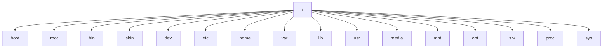

#Linux目录
注：这里是参考了<https://www.cnblogs.com/fengqixuepiao/p/13914758.html>
##1.Linux系统目录
在Linux系统中，逻辑上所有目录只有一个顶点/(根)，根目录就是所有目录的起点。

##2.Linux主目录结构
在Linux系统中目录结构和分区设备是没有关系的，也就是不同的目录可以跨越不同的磁盘设备或分区。Linux的目录结构也是有规侓的，而且是按照类别组织的。应用程序：/usr/bin；数据文件：/usr/share；配置文件：/etc/；启动命令：/etc/init.d。

| 目录 | 作用 |
| --- | --- |
| / | 存放系统系统相关的目录文件；|
| /boot | 放置linux系统内核文件和启动时用到的一些引导文件 |
| /home |包含linux系统上各用户的主目录，子目录名称默认以该用户名命名 |
| /root |系统管理员root的家目录 |
| /bin |包含常用的命令文件（如ls 等），不能包含子目录 |
|/sbin | 放置系统管理员和root用户所使用的命令文件，如fdisk、shutdown等。|
| /dev | 存放linux系统下大部分的设备文件，访问该目录下某个文件，相当于访问某个设备，常用的是挂载光驱mount /dev/   cdrom /mnt。|
| /lib |包含linux系统的共享文件和内核模块文件。 /lib/modules目录存放核心可加载模块。 |
| /lib64 | 包含64位版本linux系统的共享文件和内核模块版本 |
| /tmp | 临时文件（temporary files）目录,任何人都可以访问 |
| /run | 一个临时文件系统，一些程序或服务启动以后，将他们的PID放在该目录 |
| /mnt | 手动为某些设备（比如硬盘）挂载提供挂载目录 |
| /media | 由系统自动为某些设备（一般为光盘、U盘等设备）挂载提供挂载目录 |
| /opt | 用于存放第三方应用程序的安装文件，|
| /var | 放置系统执行过程中经常变化的数据，如系统日志、打印队列、DNS数据库文件等 |
| /etc |存放linux系统上大部分的配置文件，重要的配置文件有/etc/inittab、/etc/fstab、/etc/init.d、/etc/X11、/etc/sysconfig、/etc/xinetd.d 建议修改配置文件之前记得备份。|
| /usr | 包含可以供所有用户使用的程序和数据 |
| /srv | 存放一些服务启动之后需要访问的资料目录（server）|
| /proc | 是一个虚拟的文件系统，它不存在磁盘上，而是由内核在内存中产生（不占用磁盘空间），用于提供系统的相关信息，如系统核心，外部设备，网络状态。  比较重要的文件有：  /proc/cpuinfo       该文件保存计算机CPU信息（用cat可查看）  /proc/version       该文件保存linux系统版本信息   /proc/filesystems   该文件保存linux文件系统信息   /proc/meminfo       该文件保存计算机内存信息   /proc/ioports       该文件保存计算机I/O端口号信息|
| /sys |在linux系统提供热插拔能力的同时，该目录包含所监测到的硬件设置，他们被转换成/dev目录中的设备文件 |
| /lost+fount | 系统异常产生错误时，会将一些遗失的片段放置于此目录下， |
| /selinux | 强制访问控制系统目录 |

##3.Linux目录详解
###（1）根目录：/
/：根目录，位于Linux文件系统目录结构的顶层，一般根目录下只存放目录，不要存放文件，/etc、/bin、/dev、/lib、/sbin应该和根目录放置在一个分区中。

###（2）引导文件目录：/boot
/boot： 该目录中存放系统的内核文件和引导装载程序文件，/boot/vmlinuz为linux的内核文件，以及/boot/gurb。建议单独分区，分区大小100M即可。

###（3）超级用户家目录：/root
/root：系统管理员root的宿主目录，系统第一个启动的分区为/，所以最好将/root和/放置在一个分区下。

###（4）用户家目录：/home
/home： 系统默认的用户宿主目录，新增用户账号时，用户的宿主目录都存放在此目录下，~表示当前用户的宿主目录，~test表示用户test的宿主目录。建议单独分区，并设置较大的磁盘空间，方便用户存放数据。

###（5）命令文件目录：/bin;/usr/bin
/bin，/usr/bin：该目录为命令文件目录，也称为二进制目录。包含了供系统管理员及普通用户使用的重要的linux命令和二进制（可执行）文件，包含shell解释器等。  应用程序安装目录

###（6）管理员系统命令目录：/sbin,/usr/bin/
/sbin，/usr/sbin，/usr/local/sbin：放置系统管理员使用的可执行命令，如fdisk、shutdown、mount等。与/bin不同的是，这几个目录是给系统管理员root使用的命令，一般用户只能"查看"而不能设置和使用。

###（7）设备文件目录：/dev
/dev： 设备（device）文件目录，存放linux系统下的设备文件，访问该目录下某个文件，相当于访问某个设备，存放连接到计算机上的设备（终端、磁盘驱动器、光驱及网卡等）的对应文件，包括字符设备和块设备等，常用的是挂载光驱mount /dev/cdrom/mnt。

这个目录中包含了所有Linux系统中使用的外部设备。但是这里并不是放的外部设备的驱动程序，这一点和windows,dos操作系统不一样。它实际上是一个访问这些外部设备的端口。我们可以非常方便地去访问这些外部设备，和访问一个文件，一个目录没有任何区别。

<table>
    <tr>
        <th colspan = 4>Linux沿袭Unix的风格，将所有设备认成是一个文件。设备文件分为两种：块设备文件(b)和字符设备文件(c)，设备文件一般存放在/dev目录下，对常见设备文件作如下说明：</th>
    </tr>
    <tr>
        <td>/dev/hd[a-t]：</td>
        <td>IDE设备</td>
        <td>/dev/sd[a-z]：</td>
        <td>SCSI设备</td>
    </tr>
    <tr>
        <td>/dev/fd[0-7]：</td>
        <td>标准软驱</td>
        <td>/dev/ram[0-15]：</td>
        <td>内存</td>
    </tr>
    <tr>
        <td>/dev/md[0-31]：</td>
        <td>软raid设备</td>
        <td>/dev/null：</td>
        <td>无限数据接收设备，相当于黑洞</td>
    </tr>
    <tr>
        <td>/dev/loop[0-7]：</td>
        <td>本地回环设备</td>
        <td>/dev/random：</td>
        <td>随机数设备</td>
    </tr>
    <tr>
        <td>/dev/zero：</td>
        <td>无限零资源</td>
        <td>/dev/urandom：</td>
        <td>随机数设备</td>
    </tr>
    <tr>
        <td>/dev/tty[0-63]：</td>
        <td>虚拟终端</td>
        <td>/dev/console：</td>
        <td>控制台</td>
    </tr>
    <tr>
        <td>/dev/ttyS[0-3]：</td>
        <td>串口</td>
        <td>/dev/lp[0-3]：</td>
        <td>并口</td>
    </tr>
    <tr>
        <td>/dev/fb[0-31]：</td>
        <td>framebuffer</td>
        <td colspan = 2>/dev/cdrom => /dev/hdc</td>
    </tr>
    <tr>
        <td colspan=2>/dev/modem => /dev/ttyS[0-9]</td>
        <td colspan=2>/dev/pilot => /dev/ttyS[0-9]</td>
    </tr>
</table>

###（8）系统配置文件目录：/etc
/etc： 系统配置文件存放的目录，该目录存放系统的大部分配置文件和子目录，不建议在此目录下存放可执行文件，重要的配置文件有/etc/inittab、/etc/fstab、/etc/init.d、/etc/X11（X Window系统有关）、/etc/sysconfig（与网络有关）、/etc/xinetd.d修改配置文件之前记得备份。该目录下的文件由系统管理员来使用，普通用户对大部分文件有只读权限。

| 目录/文件 | 意义 |
| --- | --- |
| /etc/redhat-release | 系统版本信息文件 |
| /etc/hosts | 设定用户自已的IP与名字的对应表 |
| /etc/sysconfig | 网络配置相关目录  /etc/sysconfig/network-scripts/ifcfg-eth0：网卡配置文件 |
| /etc/networks | 设定网络的配置文件 |
| /etc/sudoers | 可以执行使用sudo命令的配置文件 |
| /etc/syslog.conf | 系统记录程序syslogd的配置文件 |
| /etc/login.defs | login 命令的配置文件。|
| /etc/login.access | 控制用户登录权限的文件 |
| /etc/hosts.allow | 设置允许使用inetd的机器使用 |
| /etc/hosts.deny | 设置不允许使用inetd的机器使用 |
| /etc/profile  /etc/csh.login   /etc/csh.cshrc | 登录或启动时Bourne或C shells执行的文件，这允许系统管理员为所有用户建立全局缺省环境。|
| /etc/rc， /etc/rc.d， /etc/rc*.d | 启动、或改变运行级时运行的scripts或scripts的目录。|
| /etc/passwd | 用户数据库，其中的域给出了用户名、真实姓名、家目录、加密的口令和用户的其他信息。|
| /etc/group | 类似/etc/passwd ，但说明的不是用户而是用户组。
| /etc/shadow | 在安装了影子口令软件的系统上的影子口令文件.影子口令文件将/etc/passwd 文件中的加密口令移动到/etc/shadow 中，而后者只对root可读这使破译口令更困难.
| /etc/inittab  | init 的配置文件，设定系统启动时init进程将把系统设置成什么样的runlevel 。
|/etc/motd | 超级用户发布通知的地方成功登录后自动输出内容由系统管理员确定，经常用于通告信息，如计划关机时间的警告。登录提醒
| /etc/issue | 在登录提示符前的输出信息.通常包括系统的一段短说明或欢迎信息内容由系统管理员确定。记录用户登录前显示的系统信息
| /etc/fstab | 启动时mount -a命令(在/etc/rc 或等效的启动文件中)自动mount的文件系统列表。Linux下，也包括用swapon -a启用的swap区的信息。记录开机要mount的文件系统
|/etc/securetty | 确认安全终端，即哪个终端允许root登录.一般只列出虚拟控制台，这样就不可能(至少很困难)通过modem或网络闯入系统并得到超级用户特权。
| /etc/shells | 列出可信任的shell.chsh 命令允许用户在本文件指定范围内改变登录shell.提供一台机器FTP服务的服务进程ftpd 检查用户shell是否列在 /etc/shells 文件中，如果不是将不允许该用户登录.
| /etc/DIR_COLORS | 设定颜色
| /etc/HOSTNAME | 设定用户的节点名
| /etc/host.conf | 文件说明用户的系统如何查询节点名
| /etc/NETWORKING  | 只有YES标明网络存在
| /etc/hosts.equiv | 设置远端机不用密码
| /etc/inetd.conf | 设定系统网络守护进程inetd的配置
| /etc/inetd.pid | inetd这个进程的进程id
| /etc/hosts.lpd | 设定远端有哪些节点可以使用本机的打印机
| /etc/gateways | 设定路由器
| /etc/protocols | 设定系统支持的协议
| /etc/named.boot | 设定本机为名字服务器的配置文件
| /etc/named.pid | 本机上运行的名字服务器的进程id
| /etc/resolv.conf | 设定系统的名字服务器
| /etc/services | 设定系统的端品与协议类型和提供的服务
| /etc/exports | 设定NFS系统用的
| /etc/NNTP_INEWS_DOMAIN | 设置新闻服务器的配置文件
| /etc/nntpserver | 设置用户使用的新闻服务器的地址
| /etc/XF86Config | X Window的配置文件
| /etc/hostid | 系统独有的一个硬件id
| /etc/at.deny  | 哪些用户不能使用at命令
| /etc/bootptab | 给MAKEDEV程序设定各种不同的设备驱动文件的格式
| /etc/makedev.cfg | 同DEVINFO一样给MAKEDEV使用的设置文件
| /etc/diphosts | 设置拔号服务器的用户名和口令
| /etc/slip.hosts,  /etc/slip.login | 设定SLIP的配置文件
| /etc/fastboot | 使用shutdown –f产生的，重启系统要查这个文件
| /etc/ftpaccess | FTP服务器的一些配置
| /etc/ftpconversions | 设定在FTP时使用的过滤器的位置
| /etc/ftpusers | 设定不能使用FTP服务的用户
| /etc/ld.so.cache | 查找系统动态链接库的缓存 
| /etc/ld.so.conf | 系统动态链接库的路径
| /etc/lilo.conf | lilo的配置文件
| /etc/magic | 给file命令使用的
| /etc/aliases | 给sendmail使用的设置别名的文件
| /etc/mail.rc,  /etc/mailcap,  /etc/sendmail.cf,  /etc/sendmail.st | 设置sendmail的
| /etc/organization | 存放用户的名字和组织
| /etc/pnpdevices | 列出支持的Plug&Play设备
| /etc/snooptad | 监控用户的屏幕，监听的终端列表
| /etc/utmp | 目前在用系统的用户信息
| /etc/wtmp | 同utmp差不多，只是它累加
| /etc/nologin | 系统在shutdown时不希望用户登录就产生这个文件
| /etc/termcap | 设置系统终端信息的
| /etc/ttys | 设定系统的终端类型
| /etc/gettydefs | getty_ps的定义文件
| /etc/yp.conf | NIS的配置文件
| /etc/mtools.conf | 设定mtools程序的参数
| /etc/fdprm | 设定格式化软盘的参数

###（9）系统进程及内核信息目录：/proc
/proc： 此目录的数据都在内存中，如系统核心，外部设备，网络状态，由于数据都存放于内存中，所以不占用磁盘空间，比较重要的目录有/proc/cpuinfo、/proc/interrupts、/proc/dma、/proc/ioports、/proc/net/*等。进程信息及内核信息

| 目录/文件 | 意义 |
| --- | --- |
| /proc/cpuinfo | 查看CPU相关信息，包含时脉、类型与运算功能等；查看关于处理器的信息，如厂家，型号和性能等，
| /proc/meminfo | 系统的内存信息； free 列出的内存资讯，在这里也能够查阅到。
| /proc/loadavg | 查看系统负载信息； top 以及 uptime命令，上头的三个平均数值就是记录在此。
| /proc/sys/kernel | 系统内核版本信息    
| /proc/swaps | 到底系统挂加载的内存在哪里？使用掉的 partition 就记录在此啦。
| /proc/version | 内核的版本，就是用 uname -a 显示的内容。
| /proc/mounts | 系统已经挂载的数据，就是用 mount 这个命令呼叫出来的数据。
| /proc/ioports | 系统端口信息
| /proc/uptime | 就是用 uptime 的时候，会出现的资讯。
| /proc/filesystems | 目前系统已经加载的文件系统。
| /proc/partitions | 使用 fdisk -l 会出现目前所有的 partition，在这个文件当中也有纪录。
| /proc/cmdline | 加载 kernel 时所下达的相关参数，查阅此文件，可了解系统是如何启动。
| /proc/devices | 这个文件记录了系统各个主要装置的主要装置代号，与 mknod 有关
| /proc/interrupts | 目前系统上面的 IRQ 分配状态。
| /proc/ioports | 目前系统上面各个装置所配置的 I/O 位址。
| /proc/kcore | 这个就是内存的大小，但是不要读他。
| /proc/modules | 目前我们的 Linux 已经加载的模块列表，也可以想成是驱动程序。
| /proc/pci | 在 PCI 汇流排上面，每个装置的详细情况，可用 lspci 来查阅。
| /proc/bus/* | 一些汇流排的装置，还有 U盘 的装置也记录在此。

###（10）临时挂载文件系统目录：/mnt，/media
/mnt，/media： mnt目录主要用来临时挂载文件系统，为某些设备提供默认挂载点，如floppy，cdrom。这样当挂载了一个设备如光驱时，就可以通过访问目录/mnt/cdrom下的文件来访问相应的光驱上的文件了。

###（11）经常变化文件目录：/var
/var： 放置系统执行过程中经常变化的文件，每个系统是特定的，即不通过网络与其他计算机共享。如随时更改的日志文件 /var/log。/var/log/message： 所有的登录文件存放目录；/var/log/secure:系统安全日志信息文件；/var/spool/cron:定时任务的配置文件。 建议单独分区，设置较大的磁盘空间。

| 目录/文件 | 意义 |
| --- | --- |
| /var/log | 各种程序的Log文件，特别是login (/var/log/wtmp log所有到系统的登录和注销) 和syslog (/var/log/messages 里存储所有核心和系统程序信息. /var/log 里的文件经常不确定地增长，应该定期清除。/var/log/secure（系统登录信息日志、系统安全日志信息文件）
| /var/local | /usr/local 中安装的程序的可变数据(即系统管理员安装的程序).注意，如果必要，即使本地安装的程序也会使用其他/var 目录，例如/var/lock 。
| /var/lock | 锁定文件.许多程序遵循在/var/lock 中产生一个锁定文件的约定，以支持他们正在使用某个特定的设备或文件.其他程序注意到这个锁定文件，将不试图使用这个设备或文件。
| /var/lib | 系统正常运行时要改变的文件。
| /var/run | 保存到下次引导前有效的关于系统的信息文件.例如， /var/run/utmp 包含当前登录的用户的信息。
| /var/spool  /var/mail  /var/news | 打印队列和其他队列工作的目录.每个不同的spool在/var/spool 下有自己的子目录，例如，用户的邮箱在/var/spool/mail 系统用户邮件目录。/var/spool/clientmqueue邮件临时存放地点；/var/spool/cron  定时任务的配置文件
| /var/tmp | 比/tmp 允许的大或需要存在较长时间的临时文件。 (虽然系统管理员可能不允许/var/tmp 有很旧的文件.)
| /var/catman | 当要求格式化时的man页的cache.man页的源文件一般存在/usr/man/man* 中；有些man页可能有预格式化的版本，存在/usr/man/cat* 中.而其他的man页在第一次看时需要格式化，格式化完的版本存在/var/man 中，这样其他人再看相同的页时就无须等待格式化了. (/var/catman 经常被清除，就象清除临时目录一样.)

###（12）临时文件目录：/tmp
/tmp：存放临时文件目录， 一般用户或正在执行的程序临时存放文件的目录，一些命令和应用程序会用的到这个目录；任何人都可以访问该目录，且该目录下的所有文件会被定时删除，以避免临时文件占满整个磁盘。

###（13）额外软件存放目录：/opt
/opt： 给主机额外安装软件所摆放的目录。如：FC4使用的Fedora 社群开发软件，如果想要自行安装新的KDE 桌面软件，可以将该软件安装在该目录下。以前的 Linux 系统中，习惯放置在 /usr/local 目录下。

 

###（14）系统库函数目录：/lib,/usr/lib,/usr/local/lib
/lib，/usr/lib，/usr/local/lib：系统使用的函数库的目录，程序在执行过程中，需要调用一些额外的参数时需要函数库的协助，该目录下存放了各种编程语言库。典型的linux系统包含了C、C++和FORTRAN语言的库文件。/lib目录下的库映像文件可以用来启动系统并执行一些命令，目录/lib/modules包含了可加载的内核模块，/lib目录存放了所有重要的库文件，其他的库文件则大部分存放在/usr/lib目录下。

###（15）应用程序存放目录：/usr
/usr： 应用程序存放目录，最庞大的目录，因为所有应用程序几乎都安装在这里， 本地安装的程序和其他东西在/usr/local 下； /usr/share 存放共享数据，/usr/lib 存放不能直接运行的，却是许多程序运行所必需的一些函数库文件，/usr/share/doc 系统说明文件存放目录。/usr/share/man:  程序说明文件存放目录 ，使用 man ls时会查询/usr/share/man/man1/ls.1.gz的内容。

| 目录/文件 | 意义 |
| --- | --- |
| /usr/bin | 几乎所有用户命令存放在这里；有些命令在/bin 或/usr/local/bin 中。
| /usr/sbin  | 根文件系统不必要的系统管理命令，例如多数服务、应用程序等。
| /usr/etc | 存放配置文件。
| /usr/share  | 存放结构独立的数据/共享数据
| /usr/share/man    /usr/share/info    /usr/share/doc | 手册页、GNU信息文档和各种其他文档文件。
| /usr/share/doc | 系统说明文件存放目录
| /usr/share/man: |  程序说明文件存放目录
| /usr/lib | 程序或子系统的不变的数据文件，包括一些site-wide配置文件，名字lib来源于库(library)， 编程的原始库存在/usr/lib 里。
| /usr/src | 存放程序的源代码，linux内核的源代码存放在/usr/src/kernels。
| /usr/local | 本地安装的软件和其他文件放在这里，/usr/local/bin存放本地增加的命令，/usr/local/include存放本地增加的库文件。
| /usr/include | 开发和编译应用程序所需要的头文件。
| /usr/games | 存放游戏和教学文件。

###（16）服务数据目录：/srv
/srv： 服务启动之后需要访问的数据目录，如www服务需要访问的网页数据存放在/srv/www内。

###（17）碎片文件目录：/lost+fount
/lost+fount： 在EXT2或EXT3文件系统中，当系统意外崩溃或机器意外关机，产生的一些文件碎片放在这里。在系统启动的过程中fsck工具会检查这里，并修复已经损坏的文件系统。有时系统发生问题，有很多的文件被移到这个目录中，可能会用手工的方法来修复，或者移动文件到运来的位置上

##4.重要参数目录详解

在 Linux 系统中，有几个目录是特别需要注意的，以下提供几个需要注意的目录，以及预设相关的用途：

###（1）　配置文件目录：/etc
/etc：这个目录相当重要，如前所述，你的开机与系统数据文件均在这个目录之下，因此当这个目录被破坏，那你的系统大概也就差不多该死掉了！而在往后的文件中，你会发现我们常常使用这个目录下的 /etc/rc.d/init.d 这个子目录，因为这个 init.d 子目录是开启一些 Linux 系统服务的 scripts的地方。而 /etc/rc.d/rc.local 这个文件是开机的执行文档。　

###（2）系统执行文件目录: /bin, /sbin,
/bin, /sbin, /usr/bin, /usr/sbin：这是系统预设的执行文件的放置目录，例如 root 常常使用的 userconf, netconf, perl, gcc, c++ 等等的数据都放在这几个目录中，所以如果你在提示字符下找不到某个执行档时，可以在这四个目录中查一查！其中， /bin, /usr/bin 是给系统使用者使用的指令，而 /sbin, /usr/sbin 则是给系统管理员使用的指令！ 

###（3）升级目录：/usr/local
/usr/local：这是系统预设的让你安装你后来升级的套件的目录。例如，当你发现有更新的 Web 套件（如 Apache ）可以安装，而你又不想以 rpm 的方式升级你的套件，则你可以将 apache 这个套件安装在 /usr/local 底下。安装在这里有个好处，因为目前大家的系统都是差不多的，所以如果你的系统要让别人接管的话，也比较容易上手呀！也比较容易找的到数据喔！因此，如果你有需要的话，通常我都会将 /usr/local/bin 这个路径加到我的 path 中。

###（4）用户家目录：/home
/home：这个是系统将有账号的普通用户的家目录设置的地方。 　

###（5）记录变化目录：/var
/var：这个路径就重要了！不论是登入、各类服务的问题发生时的记录、以及常态性的服务记录等等的记录目录，所以当你的系统有问题时，就需要来这个目录记录的文件数据中查看问题的所在！而 mail 的预设放置也是在这里，所以他是很重要的 。

###（6）说明文档目录：/usr
/usr/share/man, /usr/local/man： 这两个目录为放置各类套件说明档的地方，例如你如果执行 man man，则系统会自动去找这两个目录下的所有说明文件。

