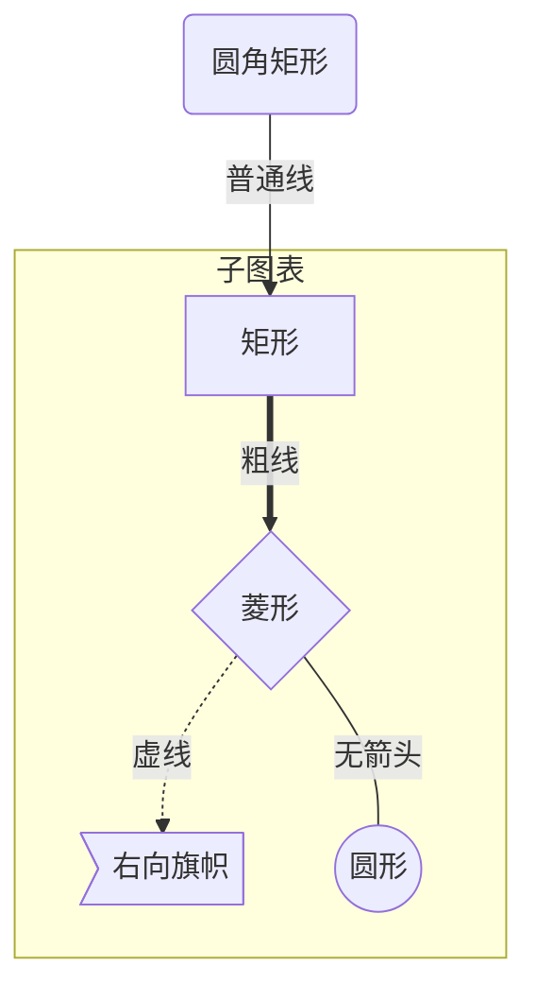

#Mermaid 实用教程
Mermaid 是一个用于画流程图、状态图、时序图、甘特图的库，使用 JS 进行本地渲染，广泛集成于许多 Markdown 编辑器中。
Mermaid 作为一个使用 JS 渲染的库，生成的不是一个“图片”，而是一段 HTML 代码，因此安全许多。
官网：https://mermaidjs.github.io/
Github 项目地址：https://github.com/knsv/mermaid
#流程图
##图表方向
Mermaid 支持多种图表的方向，语法如下：
```
graph 方向描述
    图表中的其他语句...
```
其中“方向描述”为

| 用词 | 含义 |
| --- | --- |
| TB | 从上到下 |
| BT | 从下到上 |
| RL | 从右到左 |
| LR | 从左到右 |

##节点定义
即流程图中每个文本块，包括开始、结束、处理、判断等。Mermaid 中每个节点都有一个 id，以及节点的文字。

| 表述 | 说明 |
| --- | --- |
| id[文字] | 矩阵节点 |
| id(文字) | 圆角矩形节点 |
| id((文字)) | 圆形节点 |
| id>文字] | 右向旗帜状节点 |
| id | 菱形节点 |

需要注意的是，如果节点的文字中包含标点符号，需要时用双引号包裹起来。
另外如果希望在文字中使用换行，请使用 替换换行

##节点间的连线
| 表述 | 说明 |
| --- | --- |
| > | 添加尾部箭头 |
| - | 不添加尾部箭头 |
| - - | 单线 |
| - -text- - | 单线上加文字 |
| == | 粗线 |
| == text == | 粗线上加文字 |
| -.- | 虚线 |
| -.text.- | 虚线加文字 |

##子图表
使用以下语法添加子图表
```
subgraph 子图表名称
    子图表中的描述语句...
end
```
##对 fontawesome 的支持
使用 fa: #图表名称# 的语法添加 fontawesome。
举个例子
源代码
```
graph TB
    id1(圆角矩形)--普通线-->id2[矩形]
    subgraph 子图表
        id2==粗线==>id3{菱形}
        id3-.虚线.->id4>右向旗帜]
        id3--无箭头---id5((圆形))
    end
```
效果


